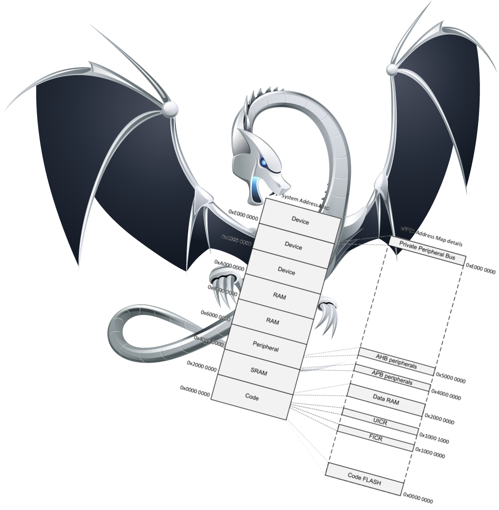

<!-- $theme: default -->
# Device-specific Clang Tooling for Embedded Systems

Jackie Kay
jackieokay.com

emBO++, 18/2/17

---
# Goal:
Feed device memory maps to the compiler.



---
# How?

1. Parse CMSIS SVD file to get device memory map.
2. Write Clang AST matchers to locate raw memory accesses and fix-its to refactor accesses for type-safety and readability.
3. Run matchers over code.

---
# Step One
---

To parse CMSIS SVD files, use the same Python backend that generates Kvasir header files.

```
namespace clock_hfclkrun {
using Addr = bit::Address<0x40000408, 0xfffffffe,
                          0x00000000, unsigned>;

enum class StatusVal : unsigned {
    nottriggered=0x00000000,
    triggered=0x00000001,
};

constexpr Register::FieldLocation<Addr,
  bit::maskFromRange(0, 0),
  bit::ReadWriteAccess, StatusVal> status{};
/* ... */
```

---

Generate YAML that associates registers, fields, and values.

```
- address: 0x40000408
  name: clock_hfclkrun
  fields:
  - mask: 0x1
    name: status
    values:
    - name: nottriggered
      value: 0x0
    - name: triggered
      value: 0x1
```

---
# Step Two
---
We want to find this:
```
*(volatile uint32_t*)0x40000408 = 0x1;
```
And turn it into this:
```
apply(write(clock_hfclkrun::statusValC::triggered));
```

---
Writing a `clang-tidy` check offers a powerful framework for:
- Registering AST Matchers
- Configuration and command line options
- Pretty-printing diagnostics
- Refactoring with fix-its

---
# Writing an AST Matcher
```
auto volatileDereferenceMatcher = allOf(
  unaryOperator(hasOperatorName("*"),
    hasUnaryOperand(ignoringParenImpCasts(
      explicitCastExpr(
        hasDestinationType(isAnyPointer()),
        hasSourceExpression(expr().bind("address")))
    ))
  ),
  expr(hasType(isVolatileQualified()))
);
```
Finds this:
```
*(volatile uint32_t*)0x40000408
```

---
- Load YAML representation into a map
- Check if matched expressions can be evaluated at compile-time as register values in our memory map
- Try to decompose the assigned literal into known values if applicable

---
# Fix-it hints
```
diag(MatchedLocation->getLocStart(),
  "Found write to register via volatile cast")
  << FixItHint::CreateReplacement(
    ReplacementRange, replacement);
```
Result:
```
test.c:5:3: warning: Found write to register via
volatile cast [embedded-typesafe-register-write]
  *(volatile std::uint32_t*)0x40000408 = 0x1;
  ^
  apply(write(clock_hfclkrun::statusValC::triggered))
```

---
# Step Three
---

How to compile code for the Cortex M0 with Clang from the command line on Linux?

```
clang -target arm-v6m-unknown-none-eabi \
      -ccc-gcc-name arm-none-eabi-gcc \
      -mcpu=cortex-m0 -mfloat-abi=soft \
      -mthumb -fshort-enums -specs=nosys.specs blinky.c
```

---

- Clang tooling requires "`compile_commands.json`", which is generated by CMake (`-DCMAKE_EXPORT_COMPILE_COMMANDS`)
- If using `make`, use [Bear](https://github.com/rizsotto/Bear)
- May need to tweak Bear's output to include Clang-specific flags for cross-compiling

---
Give YAML file to .clang-tidy:
```
CheckOptions:
- key: embedded-typesafe-register-write.DescriptionFile
  value: nrf51.yaml
```

To run the tool:
```
clang-tidy -checks=embedded-typesafe-register-write \
  -p compile_commands.json blinky.c
```
---

In reality, the naive AST matcher often isn't enough.

```
__STATIC_INLINE void nrf_clock_task_trigger(
  nrf_clock_task_t task)
{
  *((volatile uint32_t *)((uint8_t *)NRF_CLOCK + task))
    = NRF_CLOCK_TASK_TRIGGER;
}
```
Base peripheral offset is a literal (defined by a macro) but `task` cannot be evaluated at compile time.

Could try to analyze at call site.

---
# Step Four
---
The more we can check statically/at compile time, the better.

Register access checks are just the beginning.

The tools are already here, though one must design them with awareness of existing patterns.

Maybe we don't need to give up on legacy code if we can write great refactoring tools.

---

# Resources

- github.com/jacquelinekay/embo2017presentation
-  [Implementation of linting tool on Github](https://github.com/jacquelinekay/clang-tools-extra/tree/typesafe_register)
- [Writing a clang-tidy check](clang.llvm.org/extra/clang-tidy/#writing-a-clang-tidy-check)
- [CMSIS SVD Specification](https://www.arm.com/products/processors/cortex-m/cortex-microcontroller-software-interface-standard.php)
- [Cross-compilation using Clang](https://clang.llvm.org/docs/CrossCompilation.html)
- [nrf5 SDK from Nordic Semiconductor](https://www.nordicsemi.com/eng/Products/Bluetooth-low-energy/nRF5-SDK)
- [Kvasir Hardware Description File Generator](https://github.com/kvasir-io/HardwareDescriptionFileGenerator)